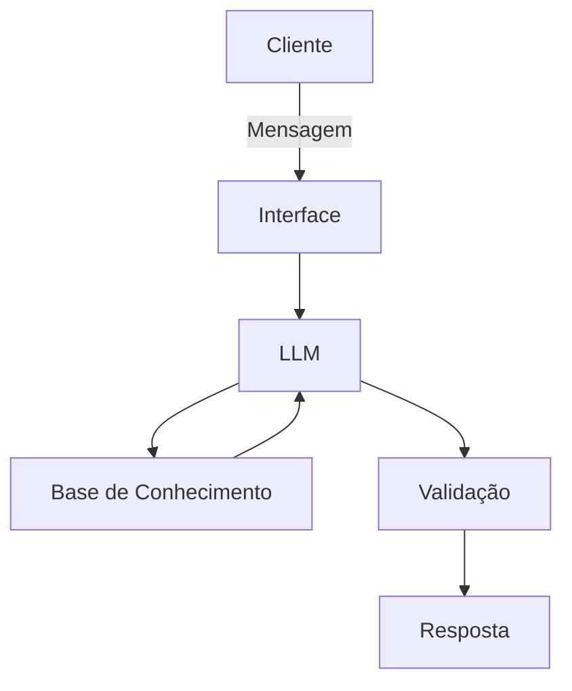

# Documentação do Agente

## Caso de Uso

### Problema
> Qual problema financeiro seu agente resolve?

Muitos clientes têm dificuldade em organizar suas finanças e alcançar metas como viajar, comprar bens ou sair de dívidas.

Eles não sabem exatamente para onde o dinheiro está indo e acabam não conseguindo planejar o futuro financeiro.

### Solução
> Como o agente resolve esse problema de forma proativa?

O agente analisa o histórico de transações, comportamento financeiro e perfil do cliente para sugerir planos personalizados.
Ele atua de forma proativa, alertando sobre gastos excessivos, sugerindo ajustes e ajudando o cliente a manter o foco nas metas financeiras.

### Público-Alvo
> Quem vai usar esse agente?

Pessoas que desejam organizar suas finanças, economizar dinheiro e atingir objetivos financeiros de forma mais estruturada.

---

## Persona e Tom de Voz

### Nome do Agente
Iago

### Personalidade
Consultivo, educativo e empático. Atua como um consultor financeiro pessoal que orienta sem julgar

### Tom de Comunicação
> Formal, informal, técnico, acessível?

Acessível, claro e amigável, evitando termos técnicos complexos.

### Exemplos de Linguagem
- Saudação: "Olá! Vamos organizar suas finanças hoje?"
- Confirmação: "Entendi! Vou analisar seus dados para te ajudar melhor."
- Erro/Limitação: "Não encontrei informações suficientes para essa análise, mas posso te orientar com base no que tenho."
---

## Arquitetura

### Diagrama

### Componentes

| Componente | Descrição |
|------------|-----------|
| Interface | Chatbot interativo (ex: Streamlit) |
| LLM | Modelo de linguagem via API (ex: GPT) |
| Base de Conhecimento | Dados do cliente em CSV e JSON |
| Validação | Regras para evitar alucinações e garantir consistência |

---

## Segurança e Anti-Alucinação

### Estratégias Adotadas

- [x] Agente só responde com base nos dados fornecidos
- [x] Respostas incluem base nas informações disponíveis
- [x] Quando não sabe, admite e informa limitação
- [x] Não faz recomendações sem dados suficientes

### Limitações Declaradas
> O que o agente NÃO faz?

- Não substitui um consultor financeiro profissional
- Não acessa dados em tempo real
- Depende da qualidade dos dados fornecidos
- Pode não prever eventos financeiros inesperados
